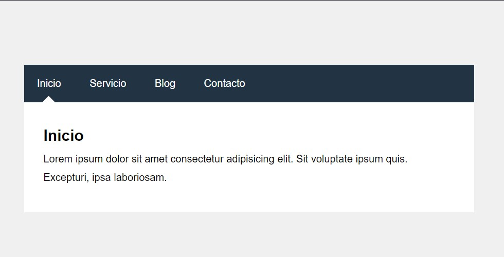
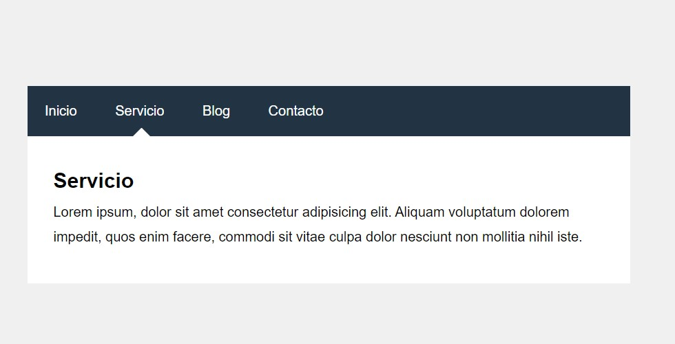
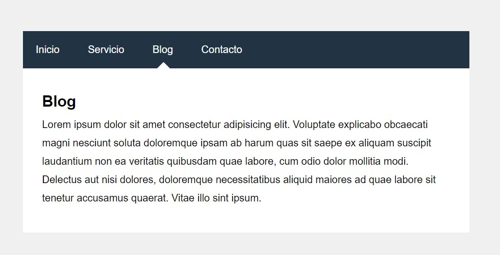
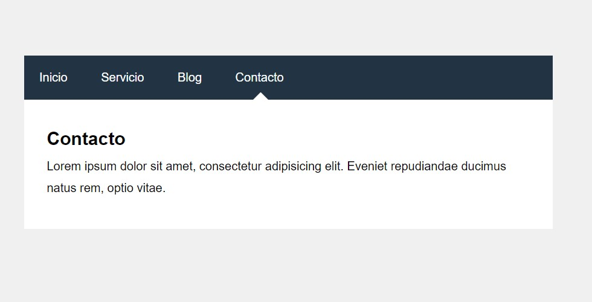

  

  # Menu de Navegacion con Tabs

  
  
  

  Un ejemplo basico de como usar Tabs para crear un Menu de Navagación, en donde las pestañas muestran diferentes vistas. 

## ¿Cuál es el fin de este proyecto?
Este proyecto se creó con fines de aprendizaje usando HTML y CSS. 

## Capturas de Pantalla
vistas referenciales de como funciona este proyecto.

  

  

  

  

## Referencias: 
- [Versión original by SLeeDw20](https://github.com/SLeeDw20/menu-tabs)
- [Video-tutorial "Como hacer un Menù de Navegación con Tabs | Html y Css | 2020"](https://www.youtube.com/watch?v=Xh94Osf1hvU)
